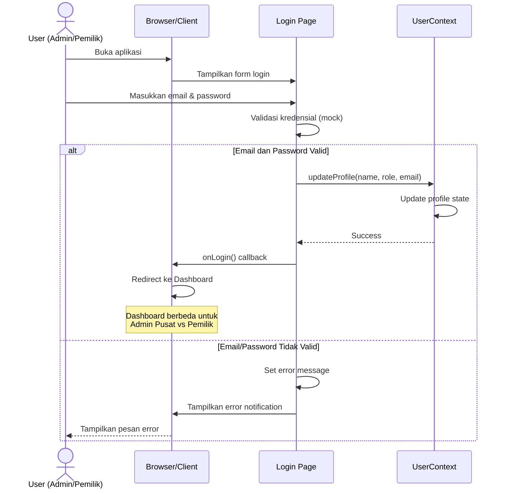
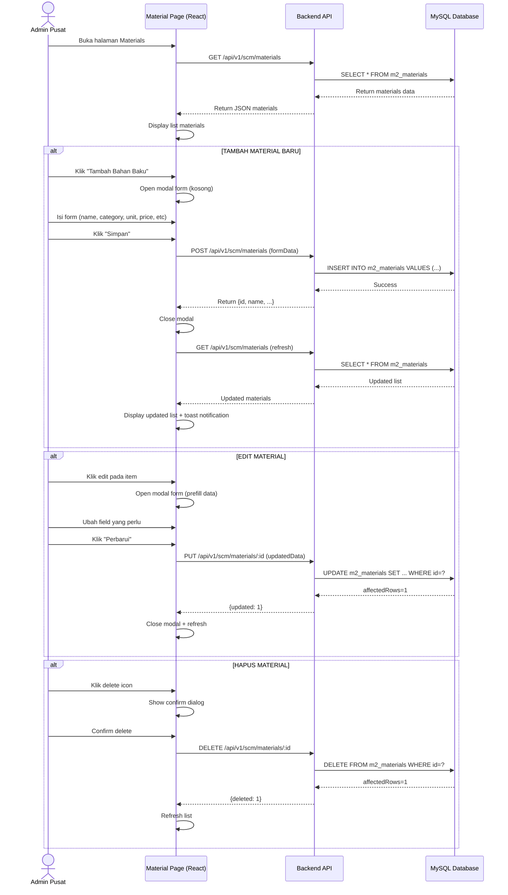
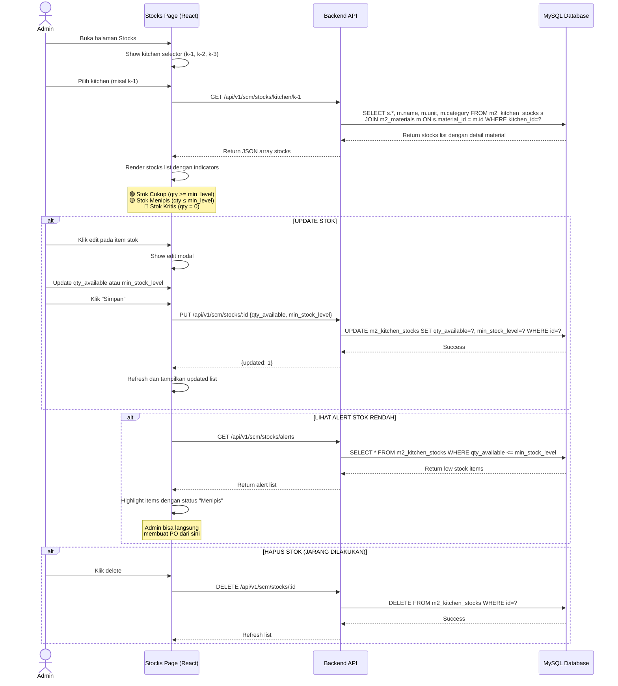
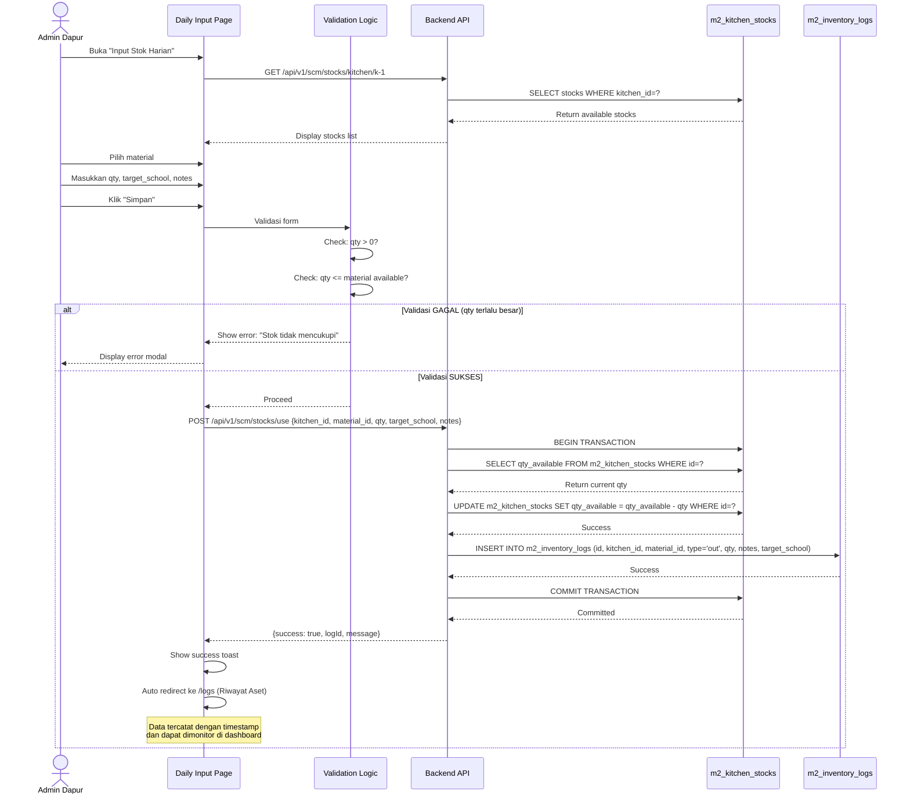
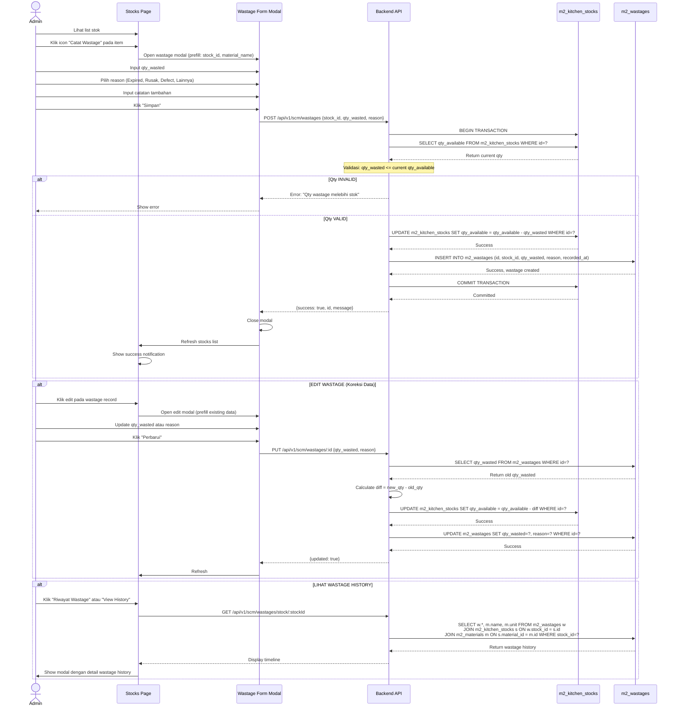
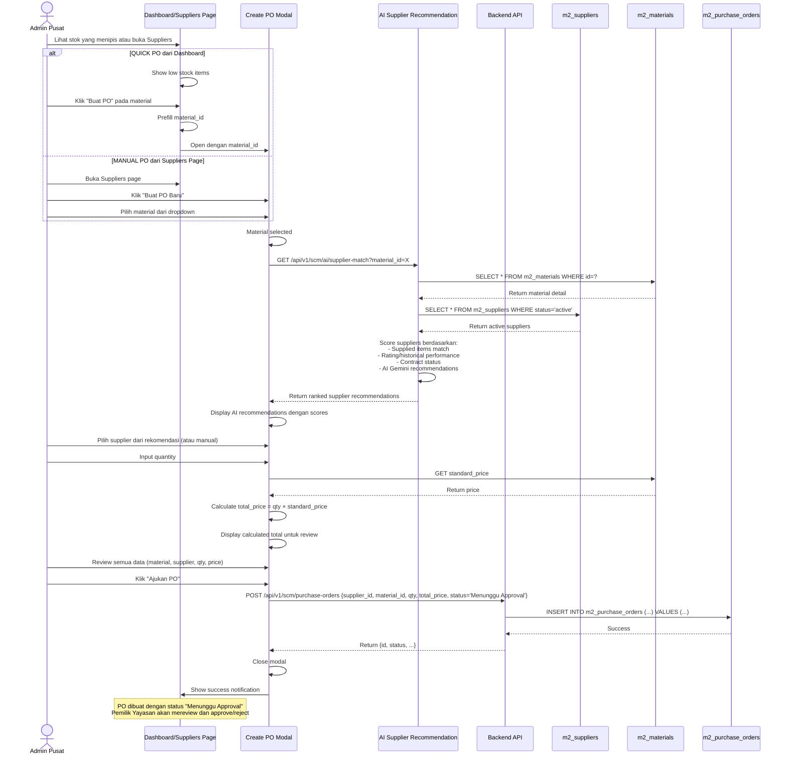
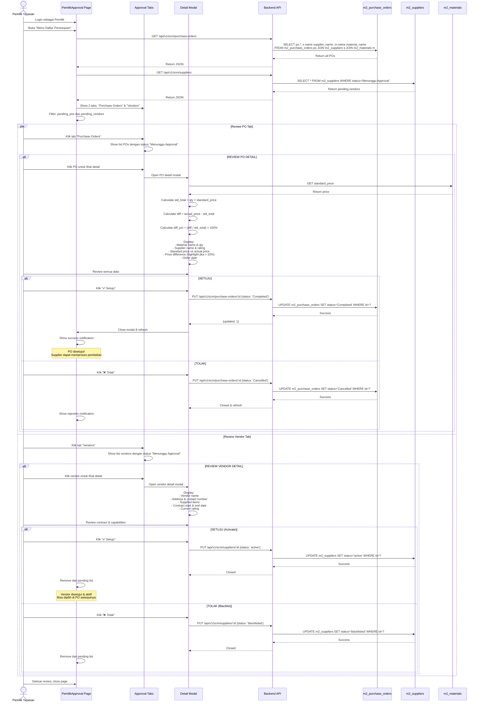
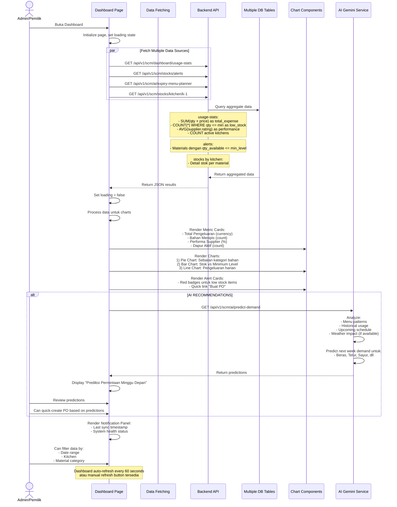
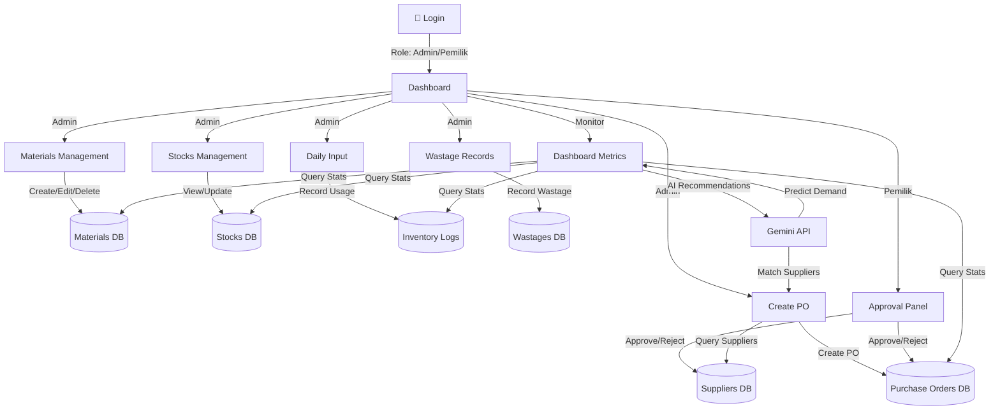

# 📊 ANALISIS SISTEM & SEQUENCE DIAGRAM - SCM-MBG

## 🎯 Ringkasan Sistem

**Nama Project:** SCM-MBG (Supply Chain Management - Makan Bergizi Gratis)

**Deskripsi:** Sistem manajemen rantai pasokan terintegrasi untuk Program Makan Bergizi Gratis (MBG) yang mengelola:
- Katalog bahan baku dan pemasok
- Manajemen stok dapur satelit
- Pencatatan penggunaan harian
- Pengelolaan pemborosan (wastage)
- Pengajuan pembelian (Purchase Order)
- Persetujuan dari Pemilik Yayasan
- Monitoring kinerja rantai pasok dengan AI

**Tech Stack:**
- **Backend:** Node.js + Express.js + MySQL
- **Frontend:** React + TypeScript + Tailwind CSS
- **Database:** MySQL dengan struktur terdata
- **AI Integration:** Google Gemini API untuk rekomendasi

**Aktor Utama:**
- **Admin Pusat** - Mengelola katalog, stok, supplier, membuat PO
- **Pemilik Yayasan** - Approval PO dan vendor
- **Admin Dapur/Gudang** - Input stok harian, catat wastage

---

## 🏗️ ARSITEKTUR DATABASE

```
m2_materials (Katalog Bahan Baku)
├── id
├── name
├── category (sayur, protein, karbo, bumbu)
├── unit (kg, liter, pcs)
├── standard_price
├── quality_status
└── expiry_date

m2_suppliers (Data Pemasok)
├── id
├── name
├── address
├── contact_number
├── status (Menunggu Approval, active, blacklisted)
├── rating
├── contract_start
├── contract_end
└── supplied_items

m2_kitchen_stocks (Stok Dapur Satelit)
├── id
├── kitchen_id
├── material_id (FK)
├── qty_available
└── min_stock_level

m2_inventory_logs (Log Penggunaan Harian)
├── id
├── kitchen_id
├── material_id (FK)
├── type (in/out)
├── qty
├── notes
├── target_school
└── created_at

m2_wastages (Log Pemborosan)
├── id
├── stock_id (FK)
├── qty_wasted
├── reason
└── recorded_at

m2_purchase_orders (Pengajuan Pembelian)
├── id
├── supplier_id (FK)
├── material_id (FK)
├── qty
├── total_price
├── status (Menunggu Approval, Completed, Cancelled)
├── order_date
```

**Key APIs:**
- `POST /api/v1/scm/materials` - Tambah bahan baku
- `PUT /api/v1/scm/materials/:id` - Update bahan baku
- `GET /api/v1/scm/stocks/kitchen/:kitchenId` - Ambil stok dapur
- `POST /api/v1/scm/stocks/use` - Catat penggunaan harian
- `POST /api/v1/scm/wastages` - Catat pemborosan
- `POST /api/v1/scm/purchase-orders` - Buat PO
- `PUT /api/v1/scm/purchase-orders/:id` - Update status PO
- `PUT /api/v1/scm/suppliers/:id` - Approve/reject supplier
- `GET /api/v1/scm/dashboard/usage-stats` - Dashboard metrics
- `GET /api/v1/scm/ai/supplier-match` - Rekomendasi supplier AI

---

## 📋 8 USE CASE & SEQUENCE DIAGRAM

### ✨ USE CASE #1: PROSES LOGIN

**Deskripsi:** Admin atau Pemilik melakukan login ke sistem dengan email dan password

**Aktor:** Admin Pusat / Pemilik Yayasan
**Precondition:** User memiliki akun terdaftar di sistem
**Postcondition:** User berhasil login dan dapat mengakses dashboard sesuai role

**Skenario Utama:**
1. User membuka halaman Login
2. User memasukkan email dan password
3. Sistem validasi kredensial (mock authentication)
4. Jika valid, update user profile di UserContext
5. Redirect ke dashboard sesuai role

**Skenario Alternatif (Gagal Login):**
- Email atau password salah → Tampilkan error message



**Kredensial Uji:**
- Admin: `admin@gmail.com` / `12345`
- Pemilik: `pemilik@gmail.com` / `12345`

---

### 📦 USE CASE #2: MENGELOLA KATALOG BAHAN BAKU

**Deskripsi:** Admin Pusat mengelola (Create, Read, Update, Delete) katalog bahan baku yang akan dipasok

**Aktor:** Admin Pusat
**Precondition:** User sudah login sebagai Admin Pusat
**Postcondition:** Katalog bahan baku tersimpan di database

**Skenario Utama (CRUD):**
1. User membuka halaman Materials
2. Sistem fetch seluruh data material dari API
3. User dapat menambah, edit, atau menghapus material
4. Untuk setiap action, data di-sync dengan backend MySQL



**Field Material:**
- Name (nama bahan baku)
- Category (sayur, protein, karbo, bumbu)
- Unit (kg, liter, pcs)
- Standard Price (harga standar)
- Quality Status (Baik, Defect, Expired)
- Expiry Date (tanggal kadaluarsa)

---

### 🏪 USE CASE #3: MENGELOLA STOK BAHAN BAKU DAPUR

**Deskripsi:** Admin mengelola data stok bahan baku di dapur satelit (Create, Update, Delete stok per material)

**Aktor:** Admin Pusat / Admin Dapur
**Precondition:** Material sudah ada di katalog
**Postcondition:** Data stok tersimpan dan dapat dimonitor

**Skenario Utama:**
1. User memilih dapur satelit (k-1, k-2, k-3)
2. Sistem tampilkan stok semua material di dapur tersebut
3. Admin dapat update qty_available atau min_stock_level
4. Sistem highlight jika stok <= minimum level



**Informasi Stok:**
- Kitchen ID (k-1, k-2, k-3)
- Material ID + detail material
- Qty Available (stok saat ini)
- Min Stock Level (minimal yang harus ada)
- Status (Cukup, Menipis, Kritis)

---

### 📥 USE CASE #4: MENGINPUT DATA STOK HARIAN

**Deskripsi:** Admin mencatat penggunaan stok bahan baku harian yang dikeluarkan dari dapur ke sekolah/penerima

**Aktor:** Admin Dapur
**Precondition:** Stok tersedia di dapur dan >= qty yang akan digunakan
**Postcondition:** Log penggunaan tersimpan, stok berkurang

**Skenario Utama:**
1. Admin membuka halaman "Input Stok Harian"
2. Pilih dapur satelit dan material
3. Masukkan quantity, target school, dan notes
4. Sistem validasi stok cukup
5. Kurangi stok, buat log penggunaan



**Proses Pencatatan:**
- Kitchen ID (pilihan dapur)
- Material ID (dropdown materials di dapur)
- Quantity (qty yang dikeluarkan)
- Target School (sekolah/penerima)
- Notes (catatan tambahan)

**Validasi:**
- ✓ Qty > 0
- ✓ Qty <= Stok Available
- ✓ Material ada di dapur

---

### ♻️ USE CASE #5: MENGELOLA DATA WASTAGE (PEMBOROSAN)

**Deskripsi:** Admin mencatat pemborosan/kerusakan bahan baku (defect, expired, rusak di perjalanan)

**Aktor:** Admin Dapur / Admin Pusat
**Precondition:** Ada stok di dapur yang rusak/expired
**Postcondition:** Wastage tercatat, stok berkurang sesuai qty wastage

**Skenario Utama:**
1. Admin membuka halaman Stocks
2. Klik tombol "Catat Wastage" pada item tertentu
3. Input qty_wasted dan reason
4. Sistem update stok dan create wastage record



**Field Wastage:**
- Stock ID (referensi stok dapur)
- Qty Wasted (qty yang rusak/hilang)
- Reason (Expired, Rusak, Defect, Hilang, Lainnya)
- Recorded At (timestamp)

**Tipe Wastage:**
- 🟠 Expired - Kadaluarsa
- 🟡 Defect - Cacat/rusak kualitas
- 🔴 Lost - Hilang/tidak terlacak

---

### 🛒 USE CASE #6: MEMBUAT PENGAJUAN PURCHASE ORDER (PO)

**Deskripsi:** Admin Pusat membuat pengajuan pembelian (PO) ke supplier dengan jumlah dan harga

**Aktor:** Admin Pusat
**Precondition:** Material dan Supplier sudah terdaftar, stok menipis atau ada kebutuhan
**Postcondition:** PO dibuat dengan status "Menunggu Approval"

**Skenario Utama:**
1. Admin buka halaman Suppliers atau Dashboard
2. Klik "Buat PO" dan pilih supplier
3. Sistem rekomendasi supplier via AI berdasarkan material
4. Input qty dan review total price (qty × standard_price)
5. Submit PO untuk persetujuan Pemilik



**Field PO:**
- Supplier ID
- Material ID
- Quantity
- Total Price (auto-calculated)
- Order Date (auto)
- Status (Menunggu Approval, Completed, Cancelled)

**Workflow:**
1. ✏️ Admin Pusat: Buat PO → Status: "Menunggu Approval"
2. 👀 Pemilik: Review PO (harga, supplier, qty)
3. ✅/❌ Pemilik: Approve → "Completed" atau Reject → "Cancelled"

---

### ✅ USE CASE #7: MELAKUKAN APPROVAL VENDOR

**Deskripsi:** Pemilik Yayasan melakukan approval terhadap Purchase Order dan vendor yang diajukan

**Aktor:** Pemilik Yayasan
**Precondition:** Ada PO dan/atau vendor baru dengan status "Menunggu Approval"
**Postcondition:** PO/vendor di-approve (Completed/active) atau di-reject (Cancelled/blacklisted)

**Skenario Utama:**
1. Pemilik buka halaman "Menu Daftar Persetujuan"
2. Lihat tab "Purchase Order" dan "Vendor"
3. Review detail PO: bandingkan harga dengan standard_price, lihat supplier rating
4. Approve atau Tolak dengan catatan



**Decision Criteria:**
- ✅ **Approve PO:** Harga reasonable, supplier trusted, qty sesuai kebutuhan
- ❌ **Reject PO:** Harga jauh lebih mahal (>15%), supplier history buruk
- ✅ **Approve Vendor:** Credentials ok, supplied items sesuai, contract terms acceptable
- ❌ **Reject Vendor:** Dokumentasi tidak lengkap, reputation buruk, terms tidak sesuai

---

### 📊 USE CASE #8: MEMANTAU LAPORAN KINERJA RANTAI PASOK

**Deskripsi:** Admin Pusat dan Pemilik memantau dashboard kinerja rantai pasok dengan metrik, grafik, dan rekomendasi AI

**Aktor:** Admin Pusat / Pemilik Yayasan
**Precondition:** Ada data stok, logs, dan wastages tersimpan
**Postcondition:** Dashboard menampilkan metrik real-time dan insight

**Skenario Utama:**
1. User buka Dashboard
2. Sistem aggregates data dari semua tables
3. Tampilkan metrik cards, charts, alerts
4. Show AI recommendations untuk optimasi



**Metrik Dashboard:**
1. **Total Pengeluaran** - Rp yang sudah dikeluarkan bulan ini
2. **Bahan Menipis** - Count items dengan stok ≤ min level
3. **Performa Supplier** - Average rating dari supplier aktif
4. **Dapur Aktif** - Jumlah dapur operasional

**Visualisasi:**
- 📊 Pie Chart - Sebaran material per kategori (kg)
- 📈 Bar Chart - Perbandingan Stok vs Minimum Level
- 📉 Line Chart - Tren pengeluaran harian

**Alert & Notification:**
- 🔴 Stok Kritis (0 kg)
- 🟡 Stok Menipis (≤ minimum)
- 🟢 Stok Aman (> minimum)

**AI Features:**
- 🤖 Prediksi permintaan minggu depan
- 🤖 Rekomendasi supplier terbaik per material
- 🤖 Saran optimasi stok berdasarkan pattern

---

## 🔄 FLOW DIAGRAM INTEGRASI



---

## 🎓 RINGKASAN ALUR BISNIS UTAMA

### **Skenario Lengkap: Dari Kebutuhan Stok hingga Penerimaan Barang**

```
1️⃣ MONITORING (Dashboard)
   ├─ Admin lihat stok di semua dapur
   ├─ Alert: Beberapa material menipis
   └─ Decision: Perlu buat PO

2️⃣ PERSIAPAN PO (Materials Management)
   ├─ Admin review katalog material
   ├─ Confirm standard price & spec
   └─ Ready untuk sourcing

3️⃣ PEMILIHAN SUPPLIER (Suppliers Management + AI)
   ├─ Admin buka "Buat PO"
   ├─ Pilih material
   ├─ AI recommend top 3 suppliers
   ├─ Admin pilih supplier terbaik
   └─ Input quantity & review price

4️⃣ PERSETUJUAN PO (Pemilik Approval)
   ├─ Pemilik login & buka "Menu Persetujuan"
   ├─ Review PO: qty, price, supplier rating
   ├─ Compare dengan standard price
   ├─ Decision: Approve atau Reject
   └─ Notify Admin hasil approval

5️⃣ PENCATATAN PENGGUNAAN (Daily Input)
   ├─ Admin Dapur catat stok yang keluar
   ├─ System otomatis kurangi qty_available
   ├─ Buat inventory log untuk traceability
   └─ Data tersimpan untuk audit

6️⃣ PENCATATAN WASTAGE (Stocks)
   ├─ Admin catat barang yang rusak/expired
   ├─ System kurangi stok sesuai wastage
   ├─ Simpan reason & timestamp
   └─ Monitor trend wastage

7️⃣ MONITORING PERFORMA (Dashboard + Approval)
   ├─ Admin lihat metrik: expense, stock, performance
   ├─ Pemilik lihat rating supplier & approval backlog
   ├─ AI provide insights & recommendations
   └─ Loop back ke step 1
```

---

## 📝 KESIMPULAN

Project SCM-MBG adalah sistem manajemen rantai pasokan yang **terintegrasi penuh** dengan fitur:
- ✅ CRUD untuk materials, stok, suppliers
- ✅ Real-time tracking penggunaan harian & wastage
- ✅ Smart procurement dengan AI recommendations
- ✅ Approval workflow dengan role-based access
- ✅ Dashboard analytics dengan metrik bisnis
- ✅ Notification & alert system

**Arsitektur yang digunakan:**
- **Frontend:** React + TypeScript + Tailwind (Modern UI)
- **Backend:** Node.js + Express (Simple & scalable)
- **Database:** MySQL (Relational data structure)
- **AI:** Google Gemini API (Recommendations)

Sequence diagram di atas memberikan detail lengkap setiap use case dari perspektif aktor dan sistem, memudahkan untuk development, testing, dan dokumentasi! 🚀
