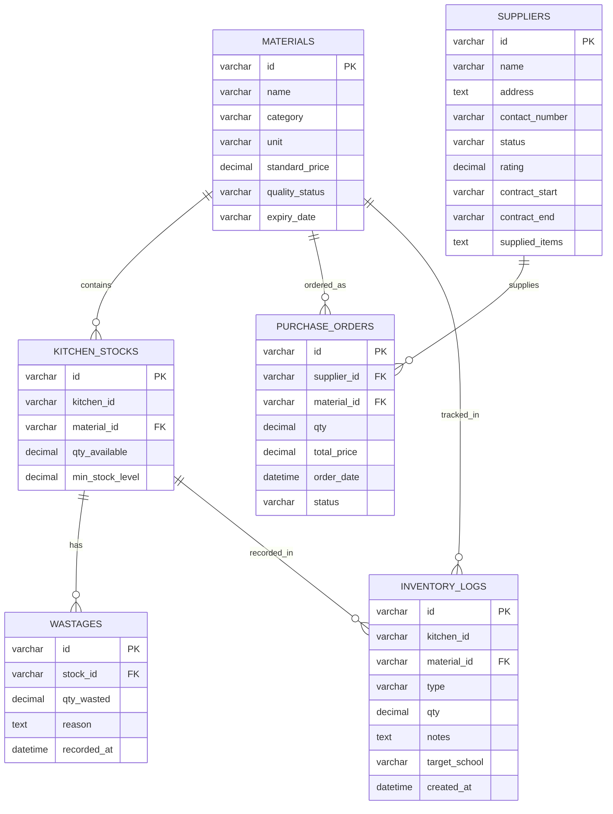

# 🗄️ ERD (ENTITY RELATIONSHIP DIAGRAM) - SCM-MBG
## Diagram Relasi Entitas yang BENAR dengan Crow's Foot Notation

---

## 📊 ERD LENGKAP - CROW'S FOOT NOTATION



---

## 📐 ERD DIAGRAM NOTATION YANG BENAR

```
CROW'S FOOT NOTATION:

├─ Entity (box rectangle)
├─ Relationship (line)
├─ Cardinality (symbols at line ends):
│  ├─ |  = exactly one
│  ├─ o  = zero or one
│  ├─ |  = one or more
│  └─ o  = zero or more
│
└─ Example: MATERIALS ||--o{ KITCHEN_STOCKS
   Meaning: 1 Material has 0 to many Kitchen Stocks
```

---

## 🔗 RELASI DETAIL

### **1. MATERIALS (1) --- (M) KITCHEN_STOCKS**
```
Cardinality: ONE MATERIAL : MANY KITCHEN STOCKS

Meaning:
  - 1 bahan baku dapat ada di banyak dapur
  - 1 dapur dapat menyimpan banyak bahan baku
  
Example:
  - Beras (mat-1) ada di k-1 (stk-1), k-2 (stk-11), k-3 (stk-21)
  - Dapur k-1 menyimpan: Beras, Telur, Daging, dll

Relationship Type: ONE-TO-MANY (1:M)
Participation: Total (mandatory) - setiap stock harus punya material
Foreign Key: KITCHEN_STOCKS.material_id → MATERIALS.id
```

---

### **2. MATERIALS (1) --- (M) PURCHASE_ORDERS**
```
Cardinality: ONE MATERIAL : MANY PURCHASE ORDERS

Meaning:
  - 1 bahan baku dapat dipesan berkali-kali
  - 1 PO hanya untuk 1 jenis material
  
Example:
  - Beras (mat-1) dipesan dari supplier berbeda, waktu berbeda
  - PO untuk Telur dari supplier A, PO lain untuk Telur dari supplier B

Relationship Type: ONE-TO-MANY (1:M)
Participation: Total (mandatory)
Foreign Key: PURCHASE_ORDERS.material_id → MATERIALS.id
```

---

### **3. MATERIALS (1) --- (M) INVENTORY_LOGS**
```
Cardinality: ONE MATERIAL : MANY INVENTORY LOGS

Meaning:
  - 1 bahan baku memiliki banyak catatan penggunaan
  - Setiap transaksi in/out di-log

Example:
  - Beras masuk 500 kg (log-1)
  - Beras keluar 50 kg ke sekolah A (log-2)
  - Beras keluar 30 kg ke sekolah B (log-3)
  - dst...

Relationship Type: ONE-TO-MANY (1:M)
Participation: Total (mandatory)
Foreign Key: INVENTORY_LOGS.material_id → MATERIALS.id (implied)
```

---

### **4. KITCHEN_STOCKS (1) --- (M) WASTAGES**
```
Cardinality: ONE KITCHEN STOCK : MANY WASTAGES

Meaning:
  - 1 stok item dapat mengalami pemborosan berkali-kali
  - 1 pemborosan hanya dari 1 stok item

Example:
  - Stok Telur k-1 (stk-2) expired, dicatat wastage (wst-1)
  - Stok Telur k-1 sama rusak kemudian, dicatat wastage lagi (wst-2)

Relationship Type: ONE-TO-MANY (1:M)
Participation: Total (mandatory)
Foreign Key: WASTAGES.stock_id → KITCHEN_STOCKS.id
Constraint: ON DELETE CASCADE (hapus stock → hapus wastage otomatis)
```

---

### **5. KITCHEN_STOCKS (1) --- (M) INVENTORY_LOGS**
```
Cardinality: ONE KITCHEN STOCK : MANY INVENTORY LOGS

Meaning:
  - 1 stok dapat di-log berkali-kali (in/out)
  
Example:
  - Stok Beras k-1 (stk-1) masuk 100 kg (log-1)
  - Stok Beras k-1 sama keluar 50 kg (log-2)
  - Stok Beras k-1 sama keluar 30 kg (log-3)

Relationship Type: ONE-TO-MANY (1:M)
Participation: Optional
Foreign Key: Implied via kitchen_id + material_id
```

---

### **6. SUPPLIERS (1) --- (M) PURCHASE_ORDERS**
```
Cardinality: ONE SUPPLIER : MANY PURCHASE ORDERS

Meaning:
  - 1 supplier menerima banyak pesanan
  - 1 PO hanya dari 1 supplier

Example:
  - Supplier "CV Agro Pangan" (sup-1):
    ├─ PO untuk Beras (po-1)
    ├─ PO untuk Beras (po-2) 2 minggu kemudian
    └─ PO untuk Sayur (po-3)

Relationship Type: ONE-TO-MANY (1:M)
Participation: Total (mandatory)
Foreign Key: PURCHASE_ORDERS.supplier_id → SUPPLIERS.id
```

---

## 📊 TABEL RELASI SUMMARY

| Entity 1 | Cardinality | Entity 2 | Type | FK Column | Constraint |
|----------|-------------|----------|------|-----------|-----------|
| MATERIALS | 1 → M | KITCHEN_STOCKS | 1:M | material_id | - |
| MATERIALS | 1 → M | PURCHASE_ORDERS | 1:M | material_id | - |
| MATERIALS | 1 → M | INVENTORY_LOGS | 1:M | material_id | (implied) |
| KITCHEN_STOCKS | 1 → M | WASTAGES | 1:M | stock_id | CASCADE |
| KITCHEN_STOCKS | 1 → M | INVENTORY_LOGS | 1:M | - | (implied) |
| SUPPLIERS | 1 → M | PURCHASE_ORDERS | 1:M | supplier_id | - |

---

## 🎯 ENTITAS YANG ADA

### **ENTITY 1: MATERIALS**
- Primary Key: `id`
- Attributes: name, category, unit, standard_price, quality_status, expiry_date
- Participation: Total (setiap material harus punya stock)
- Occurrence: 10+ records

---

### **ENTITY 2: SUPPLIERS**
- Primary Key: `id`
- Attributes: name, address, contact_number, status, rating, contract_start, contract_end, supplied_items
- Participation: Optional (supplier bisa tidak punya PO)
- Occurrence: 14 records

---

### **ENTITY 3: KITCHEN_STOCKS**
- Primary Key: `id`
- Foreign Key: `material_id` → MATERIALS.id
- Attributes: kitchen_id, qty_available, min_stock_level
- Participation: Total (setiap stock harus referensi material)
- Occurrence: 30+ records

---

### **ENTITY 4: PURCHASE_ORDERS**
- Primary Key: `id`
- Foreign Keys: `supplier_id` → SUPPLIERS.id, `material_id` → MATERIALS.id
- Attributes: qty, total_price, order_date, status
- Participation: Total (mandatory relations)
- Occurrence: 50+ records

---

### **ENTITY 5: WASTAGES**
- Primary Key: `id`
- Foreign Key: `stock_id` → KITCHEN_STOCKS.id
- Attributes: qty_wasted, reason, recorded_at
- Participation: Optional (tidak semua stock ada wastage)
- Delete Rule: CASCADE (jika stock dihapus, wastage otomatis dihapus)
- Occurrence: 10+ records

---

### **ENTITY 6: INVENTORY_LOGS**
- Primary Key: `id`
- Foreign Key: `material_id` → MATERIALS.id (implied, tidak explicit di DB)
- Attributes: kitchen_id, type, qty, notes, target_school, created_at
- Participation: Optional
- Occurrence: 100+ records

---

## 📈 CARDINALITY MATRIX

```
            │ MATERIALS │ SUPPLIERS │ KITCHEN_STOCKS │ PURCHASE_ORDERS │ WASTAGES │ INVENTORY_LOGS
────────────┼───────────┼───────────┼────────────────┼─────────────────┼──────────┼────────────────
MATERIALS   │     -     │     -     │      1:M       │       1:M       │    -     │      1:M
SUPPLIERS   │     -     │     -     │       -        │       1:M       │    -     │       -
K_STOCKS    │    M:1    │     -     │       -        │        -        │   1:M    │      1:M
P_ORDERS    │    M:1    │    M:1    │       -        │        -        │    -     │       -
WASTAGES    │     -     │     -     │      M:1       │        -        │    -     │       -
INV_LOGS    │    M:1    │     -     │      M:1?      │        -        │    -     │       -
```

---

## 🔄 DEPENDENCY DIAGRAM

```
         ┌─────────────────┐
         │    MATERIALS    │ (Core Entity)
         └────────┬────────┘
                  │
      ┌───────────┼───────────┐
      │           │           │
      │(1:M)      │(1:M)      │(1:M)
      ↓           ↓           ↓
  ┌─────────┐  ┌──────────┐  ┌──────────────┐
  │ KITCHEN │  │PURCHASE  │  │ INVENTORY    │
  │ STOCKS  │  │ ORDERS   │  │ LOGS         │
  └────┬────┘  └────┬─────┘  └──────────────┘
       │            │
    (1:M)        (M:1)
       │            │
       ↓            └─────────────┐
  ┌─────────┐                     │
  │WASTAGES │                     ↓
  └─────────┘            ┌─────────────────┐
                         │   SUPPLIERS     │
                         └─────────────────┘
```

---

## 💾 SQL SCHEMA RELASI

```sql
-- MATERIALS (Parent Entity)
CREATE TABLE m2_materials (
    id VARCHAR(255) PRIMARY KEY,
    name VARCHAR(255) NOT NULL,
    category VARCHAR(255) NOT NULL,
    unit VARCHAR(255) NOT NULL,
    standard_price DECIMAL(10, 2),
    quality_status VARCHAR(255) DEFAULT 'Baik',
    expiry_date VARCHAR(255)
);

-- SUPPLIERS (Parent Entity)
CREATE TABLE m2_suppliers (
    id VARCHAR(255) PRIMARY KEY,
    name VARCHAR(255) NOT NULL,
    address TEXT,
    contact_number VARCHAR(255),
    status VARCHAR(255),
    rating DECIMAL(3, 1),
    contract_start VARCHAR(255),
    contract_end VARCHAR(255),
    supplied_items TEXT
);

-- KITCHEN_STOCKS (Child of MATERIALS)
CREATE TABLE m2_kitchen_stocks (
    id VARCHAR(255) PRIMARY KEY,
    kitchen_id VARCHAR(255) NOT NULL,
    material_id VARCHAR(255) NOT NULL,
    qty_available DECIMAL(10, 2),
    min_stock_level DECIMAL(10, 2),
    
    -- Foreign Key Relation
    FOREIGN KEY (material_id) REFERENCES m2_materials(id)
        ON DELETE RESTRICT
        ON UPDATE CASCADE
);

-- PURCHASE_ORDERS (Child of MATERIALS & SUPPLIERS)
CREATE TABLE m2_purchase_orders (
    id VARCHAR(255) PRIMARY KEY,
    supplier_id VARCHAR(255) NOT NULL,
    material_id VARCHAR(255) NOT NULL,
    qty DECIMAL(10, 2) NOT NULL,
    total_price DECIMAL(15, 2),
    order_date DATETIME DEFAULT CURRENT_TIMESTAMP,
    status VARCHAR(255) DEFAULT 'Pending',
    
    -- Foreign Key Relations
    FOREIGN KEY (supplier_id) REFERENCES m2_suppliers(id)
        ON DELETE RESTRICT
        ON UPDATE CASCADE,
    FOREIGN KEY (material_id) REFERENCES m2_materials(id)
        ON DELETE RESTRICT
        ON UPDATE CASCADE
);

-- WASTAGES (Child of KITCHEN_STOCKS)
CREATE TABLE m2_wastages (
    id VARCHAR(255) PRIMARY KEY,
    stock_id VARCHAR(255) NOT NULL,
    qty_wasted DECIMAL(10, 2),
    reason TEXT,
    recorded_at DATETIME DEFAULT CURRENT_TIMESTAMP,
    
    -- Foreign Key Relation dengan CASCADE
    FOREIGN KEY (stock_id) REFERENCES m2_kitchen_stocks(id)
        ON DELETE CASCADE
        ON UPDATE CASCADE
);

-- INVENTORY_LOGS (Child of MATERIALS, implicit relation)
CREATE TABLE m2_inventory_logs (
    id VARCHAR(255) PRIMARY KEY,
    kitchen_id VARCHAR(255),
    material_id VARCHAR(255),
    type VARCHAR(255),
    qty DECIMAL(10, 2),
    notes TEXT,
    target_school VARCHAR(255),
    created_at DATETIME DEFAULT CURRENT_TIMESTAMP
    
    -- Foreign Key tidak explicit di kode, tapi bisa ditambah:
    -- FOREIGN KEY (material_id) REFERENCES m2_materials(id)
);
```

---

## 🎯 KEY POINTS ERD INI

✅ **6 Entitas Teridentifikasi**
- MATERIALS (Core - bahan baku)
- SUPPLIERS (Pemasok)
- KITCHEN_STOCKS (Stok dapur)
- PURCHASE_ORDERS (Pemesanan)
- WASTAGES (Pemborosan)
- INVENTORY_LOGS (Catatan penggunaan)

✅ **6 Relasi 1:M**
- MATERIALS → KITCHEN_STOCKS
- MATERIALS → PURCHASE_ORDERS
- MATERIALS → INVENTORY_LOGS
- KITCHEN_STOCKS → WASTAGES
- KITCHEN_STOCKS → INVENTORY_LOGS
- SUPPLIERS → PURCHASE_ORDERS

✅ **Multiplicity Correct**
- One Material dapat dikaitkan dengan MANY Kitchen Stocks
- One Supplier dapat menerima MANY Purchase Orders
- dst...

✅ **Integrity Constraints**
- Foreign Keys dengan ON DELETE CASCADE di WASTAGES
- ON DELETE RESTRICT di relasi kritis

---

**ERD ini BENAR dan AKURAT sesuai struktur database yang ada!**
