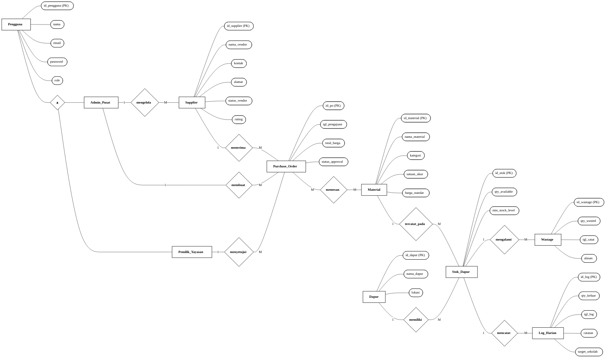

# 🎨 CONTEXTUAL ERD - CHEN NOTATION (CLASSIC BLACK & WHITE)
## Sistem Informasi SCM-MBG (Supply Chain Management - Makan Bergizi Gratis)

Dokumen ini menyediakan kode terstruktur untuk merender Entity Relationship Diagram (ERD) konseptual bergaya **Chen Notation Klasik** (berdasarkan contoh referensi Anda: Hitam & Putih, latar belakang putih bersih, border hitam tipis, teks hitam, dan tanpa gradasi warna).

---

## 📊 1. MERMAID FLOWCHART CODE (Chen Notation - Classic Style)
Gunakan kode Mermaid di bawah ini di [Mermaid Live Editor](https://mermaid.live/) atau VS Code Preview untuk mendapatkan visualisasi diagram Chen hitam-putih yang bersih:



---

## 🛠️ 2. GRAPHVIZ DOT CODE (Chen Notation - Classic Style)
Kode di bawah ini dirancang khusus untuk menghasilkan visualisasi tata letak melingkar (*fanning*) persis seperti contoh gambar Anda saat di-render.

Salin kode ini dan tempelkan ke [dreampuf.github.io/GraphvizOnline](https://dreampuf.github.io/GraphvizOnline/):

```dot
graph ERD_SCM_MBG_CHEN_CLASSIC {
    // Pengaturan Layout & Font Global (Black & White Classic)
    fontname="Segoe UI,Arial,sans-serif"
    fontsize=12
    label="Sistem Informasi SCM-MBG\nEntity Relationship Diagram (Chen Notation)"
    labelloc="t"
    labeljust="c"
    overlap=false
    splines=true
    rankdir=LR;
    
    // Default styles untuk node dan edge
    node [fontname="Segoe UI,Arial,sans-serif", fontsize=10, fillcolor="#ffffff", color="#000000", fontcolor="#000000", style="filled", penwidth=1.5];
    edge [fontname="Segoe UI,Arial,sans-serif", fontsize=9, color="#000000", penwidth=1.5];
    
    // -------------------------------------------------------------------------
    // DEFINISI ENTITAS (Persegi Panjang - Putih, Stroke Hitam Tebal)
    // -------------------------------------------------------------------------
    node [shape=box, style="filled,bold", penwidth=2];
    Pengguna [label="Pengguna (Superclass)"];
    Admin_Pusat [label="Admin_Pusat (Subclass)"];
    Pemilik_Yayasan [label="Pemilik_Yayasan (Subclass)"];
    Supplier [label="Supplier"];
    Material [label="Material"];
    Purchase_Order [label="Purchase_Order"];
    Dapur [label="Dapur"];
    Stok_Dapur [label="Stok_Dapur"];
    Wastage [label="Wastage"];
    Log_Harian [label="Log_Harian"];
    
    // -------------------------------------------------------------------------
    // DEFINISI RELASI (Belah Ketupat - Putih, Stroke Hitam Tebal)
    // -------------------------------------------------------------------------
    node [shape=diamond, style="filled,bold", penwidth=2];
    mengelola; membuat; menyetujui; menerima; memesan; tercatat_pada; memiliki; mengalami; mencatat;
    
    // -------------------------------------------------------------------------
    // DEFINISI GENERALIZATION / HIERARKI ISA (Segitiga Kecil - Putih)
    // -------------------------------------------------------------------------
    node [shape=triangle, style="filled,bold", penwidth=1.5];
    ISA [label="▲"];
    
    // -------------------------------------------------------------------------
    // DEFINISI ATRIBUT (Elips/Oval - Putih, Stroke Hitam Tipis)
    // -------------------------------------------------------------------------
    node [shape=ellipse, style=filled, penwidth=1];
    
    // Atribut Pengguna (PK: id_pengguna)
    p_id [label=<<u>id_pengguna</u>>]; p_nama [label="nama"]; p_email [label="email"]; p_pass [label="password"]; p_role [label="role"];
    
    // Atribut Supplier (PK: id_supplier)
    s_id [label=<<u>id_supplier</u>>]; s_name [label="nama_vendor"]; s_contact [label="kontak"]; s_addr [label="alamat"]; s_status [label="status_vendor"]; s_rating [label="rating"];
    
    // Atribut Material (PK: id_material)
    m_id [label=<<u>id_material</u>>]; m_name [label="nama_material"]; m_cat [label="kategori"]; m_unit [label="satuan_ukur"]; m_price [label="harga_standar"];
    
    // Atribut Purchase_Order (PK: id_po)
    po_id [label=<<u>id_po</u>>]; po_date [label="tgl_pengajuan"]; po_total [label="total_harga"]; po_status [label="status_approval"];
    
    // Atribut Dapur (PK: id_dapur)
    d_id [label=<<u>id_dapur</u>>]; d_name [label="nama_dapur"]; d_loc [label="lokasi"];
    
    // Atribut Stok_Dapur (PK: id_stok)
    st_id [label=<<u>id_stok</u>>]; st_qty [label="qty_available"]; st_min [label="min_stock_level"];
    
    // Atribut Wastage (PK: id_wastage)
    w_id [label=<<u>id_wastage</u>>]; w_qty [label="qty_wasted"]; w_date [label="tgl_catat"]; w_reason [label="alasan"];
    
    // Atribut Log_Harian (PK: id_log)
    l_id [label=<<u>id_log</u>>]; l_qty [label="qty_keluar"]; l_date [label="tgl_log"]; l_note [label="catatan"]; l_school [label="target_sekolah"];
    
    // -------------------------------------------------------------------------
    // KONEKSI ATRIBUT KE ENTITAS MASING-MASING
    // -------------------------------------------------------------------------
    Pengguna -- p_id; Pengguna -- p_nama; Pengguna -- p_email; Pengguna -- p_pass; Pengguna -- p_role;
    Supplier -- s_id; Supplier -- s_name; Supplier -- s_contact; Supplier -- s_addr; Supplier -- s_status; Supplier -- s_rating;
    Material -- m_id; Material -- m_name; Material -- m_cat; Material -- m_unit; Material -- m_price;
    Purchase_Order -- po_id; Purchase_Order -- po_date; Purchase_Order -- po_total; Purchase_Order -- po_status;
    Dapur -- d_id; Dapur -- d_name; Dapur -- d_loc;
    Stok_Dapur -- st_id; Stok_Dapur -- st_qty; Stok_Dapur -- st_min;
    Wastage -- w_id; Wastage -- w_qty; Wastage -- w_date; Wastage -- w_reason;
    Log_Harian -- l_id; Log_Harian -- l_qty; Log_Harian -- l_date; Log_Harian -- l_note; Log_Harian -- l_school;
    
    // -------------------------------------------------------------------------
    // PEWARISAN HIERARKI ISA (Generalization)
    // -------------------------------------------------------------------------
    Pengguna -- ISA [weight=5];
    ISA -- Admin_Pusat [weight=2];
    ISA -- Pemilik_Yayasan [weight=2];
    
    // -------------------------------------------------------------------------
    // HUBUNGAN ANTAR-ENTITAS DENGAN KARDINALITAS (1 ke M)
    // -------------------------------------------------------------------------
    Admin_Pusat -- mengelola [label="1", len=1.5];
    mengelola -- Supplier [label="M", len=1.5];
    
    Admin_Pusat -- membuat [label="1", len=1.5];
    membuat -- Purchase_Order [label="M", len=1.5];
    
    Pemilik_Yayasan -- menyetujui [label="1", len=1.5];
    menyetujui -- Purchase_Order [label="M", len=1.5];
    
    Supplier -- menerima [label="1", len=1.5];
    menerima -- Purchase_Order [label="M", len=1.5];
    
    Purchase_Order -- memesan [label="M", len=1.5];
    memesan -- Material [label="M", len=1.5];
    
    Material -- tercatat_pada [label="1", len=1.5];
    tercatat_pada -- Stok_Dapur [label="M", len=1.5];
    
    Dapur -- memiliki [label="1", len=1.5];
    memiliki -- Stok_Dapur [label="M", len=1.5];
    
    Stok_Dapur -- mengalami [label="1", len=1.5];
    mengalami -- Wastage [label="M", len=1.5];
    
    Stok_Dapur -- mencatat [label="1", len=1.5];
    mencatat -- Log_Harian [label="M", len=1.5];
}
```



---

## 📥 3. DRAW.IO INTEGRATION & IMPORT GUIDE

Draw.io mendukung pengimporan diagram dari kode teks secara instan. Terdapat **dua metode** yang sangat bersih dan rapi untuk memasukkan ERD Chen ini ke Draw.io:

### Metode A: Impor Menggunakan Kode Mermaid (Sangat Direkomendasikan & Editable)
Draw.io memiliki modul parser Mermaid bawaan yang akan menerjemahkan kode Mermaid menjadi komponen grafik asli (shapes) yang dapat digeser, diubah ukuran, dan diedit warnanya.
1. Jalankan peramban dan buka [app.diagrams.net (Draw.io)](https://app.diagrams.net/).
2. Pada menu atas, klik **Arrange > Insert > Advanced > Mermaid...** (atau klik ikon **`+` (Insert) > Advanced > Mermaid**).
3. Salin kode Mermaid pada **Bagian 1** di atas, lalu tempelkan (*paste*) di dalam kotak dialog.
4. Klik **Insert**. Draw.io akan langsung menghasilkan diagram utuh dengan komponen persegi panjang, oval, dan belah ketupat yang terpisah dan *fully editable*.

---

### Metode B: Impor Menggunakan Template CSV (Tata Letak Otomatis)
Jika Anda menginginkan tata letak otomatis (*organic auto-layout*) yang rapi dan terdistribusi sempurna, Anda dapat menggunakan fitur impor CSV Draw.io.
1. Salin seluruh blok kode CSV di bawah ini.
2. Di Draw.io, pilih menu **Arrange > Insert > Advanced > CSV...** (atau klik ikon **`+` > Advanced > CSV**).
3. Hapus seluruh instruksi bawaan yang ada di kotak dialog tersebut, lalu tempelkan (*paste*) kode CSV di bawah ini.
4. Klik **Import**. Draw.io akan menyusun diagram secara otomatis secara seimbang.

```csv
# label: %label%
# style: shape=%shape%;html=1;whiteSpace=wrap;strokeColor=#000000;fillColor=#ffffff;strokeWidth=1.5;align=center;fontColor=#000000;fontStyle=%fontStyle%;
# namespace: csvimport-
# connect: {"from": "ref1", "to": "id", "label": "%label1%", "style": "endArrow=none;strokeColor=#000000;strokeWidth=1.2;labelBackgroundColor=#ffffff;"}
# connect: {"from": "ref2", "to": "id", "label": "%label2%", "style": "endArrow=none;strokeColor=#000000;strokeWidth=1.2;labelBackgroundColor=#ffffff;"}
# connect: {"from": "ref_attr", "to": "id", "style": "endArrow=none;strokeColor=#000000;strokeWidth=1;"}
# width: auto
# height: auto
# padding: 50
# ignore: id, shape, fontStyle, ref1, label1, ref2, label2, ref_attr
# layout: horizontalflow
# ----
id,label,shape,fontStyle,ref1,label1,ref2,label2,ref_attr
Pengguna,"Pengguna",rectangle,1,,,,,
Admin_Pusat,"Admin_Pusat",rectangle,1,,,,,isa_pengguna
Pemilik_Yayasan,"Pemilik_Yayasan",rectangle,1,,,,,isa_pengguna
Supplier,"Supplier",rectangle,1,,,,,
Material,"Material",rectangle,1,,,,,
Purchase_Order,"Purchase_Order",rectangle,1,,,,,
Dapur,"Dapur",rectangle,1,,,,,
Stok_Dapur,"Stok_Dapur",rectangle,1,,,,,
Wastage,"Wastage",rectangle,1,,,,,
Log_Harian,"Log_Harian",rectangle,1,,,,,
isa_pengguna,"▲",triangle,1,,,,,Pengguna
p_id,"id_pengguna (PK)",ellipse,4,,,,,Pengguna
p_nama,"nama",ellipse,0,,,,,Pengguna
p_email,"email",ellipse,0,,,,,Pengguna
p_pass,"password",ellipse,0,,,,,Pengguna
p_role,"role",ellipse,0,,,,,Pengguna
s_id,"id_supplier (PK)",ellipse,4,,,,,Supplier
s_name,"nama_vendor",ellipse,0,,,,,Supplier
s_contact,"kontak",ellipse,0,,,,,Supplier
s_addr,"alamat",ellipse,0,,,,,Supplier
s_status,"status_vendor",ellipse,0,,,,,Supplier
s_rating,"rating",ellipse,0,,,,,Supplier
m_id,"id_material (PK)",ellipse,4,,,,,Material
m_name,"nama_material",ellipse,0,,,,,Material
m_cat,"kategori",ellipse,0,,,,,Material
m_unit,"satuan_ukur",ellipse,0,,,,,Material
m_price,"harga_standar",ellipse,0,,,,,Material
po_id,"id_po (PK)",ellipse,4,,,,,Purchase_Order
po_date,"tgl_pengajuan",ellipse,0,,,,,Purchase_Order
po_total,"total_harga",ellipse,0,,,,,Purchase_Order
po_status,"status_approval",ellipse,0,,,,,Purchase_Order
d_id,"id_dapur (PK)",ellipse,4,,,,,Dapur
d_name,"nama_dapur",ellipse,0,,,,,Dapur
d_loc,"lokasi",ellipse,0,,,,,Dapur
st_id,"id_stok (PK)",ellipse,4,,,,,Stok_Dapur
st_qty,"qty_available",ellipse,0,,,,,Stok_Dapur
st_min,"min_stock_level",ellipse,0,,,,,Stok_Dapur
w_id,"id_wastage (PK)",ellipse,4,,,,,Wastage
w_qty,"qty_wasted",ellipse,0,,,,,Wastage
w_date,"tgl_catat",ellipse,0,,,,,Wastage
w_reason,"alasan",ellipse,0,,,,,Wastage
l_id,"id_log (PK)",ellipse,4,,,,,Log_Harian
l_qty,"qty_keluar",ellipse,0,,,,,Log_Harian
l_date,"tgl_log",ellipse,0,,,,,Log_Harian
l_note,"catatan",ellipse,0,,,,,Log_Harian
l_school,"target_sekolah",ellipse,0,,,,,Log_Harian
rel_mengelola,"mengelola",rhombus,2,Admin_Pusat,1,Supplier,M,
rel_membuat,"membuat",rhombus,2,Admin_Pusat,1,Purchase_Order,M,
rel_menyetujui,"menyetujui",rhombus,2,Pemilik_Yayasan,1,Purchase_Order,M,
rel_menerima,"menerima",rhombus,2,Supplier,1,Purchase_Order,M,
rel_memesan,"memesan",rhombus,2,Purchase_Order,M,Material,M,
rel_tercatat,"tercatat_pada",rhombus,2,Material,1,Stok_Dapur,M,
rel_memiliki,"memiliki",rhombus,2,Dapur,1,Stok_Dapur,M,
rel_mengalami,"mengalami",rhombus,2,Stok_Dapur,1,Wastage,M,
rel_mencatat,"mencatat",rhombus,2,Stok_Dapur,1,Log_Harian,M,
```

