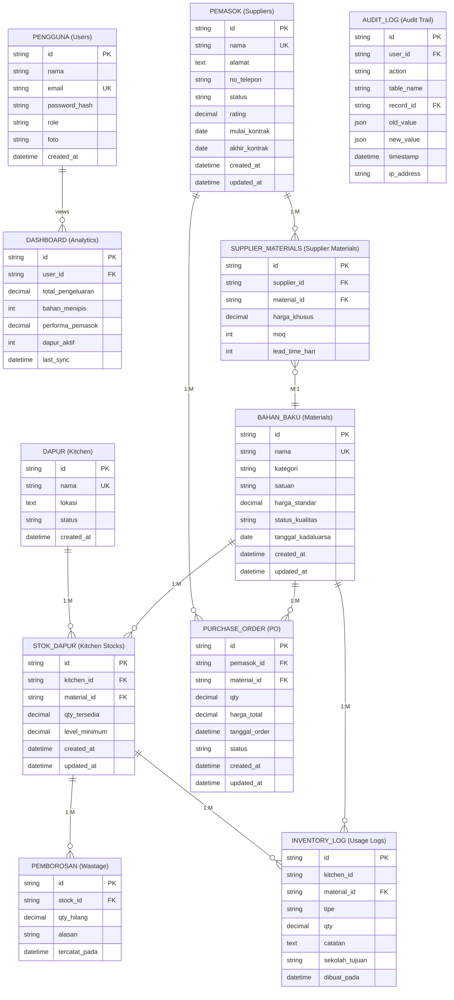

# 🗄️ ERD - ENTITY RELATIONSHIP DIAGRAM
## Visualisasi Database SCM-MBG

---

## 📊 COMPLETE ERD (Mermaid Format)



---

## 🔗 RELASI DETAIL

### 1. PENGGUNA (Users) → DASHBOARD
```
Cardinality: 1 User : M Dashboards
Type: One-to-Many
Relationship: A user can view/manage multiple dashboards
Foreign Key: DASHBOARD.user_id → PENGGUNA.id
Description: Track dashboard access per user
```

### 2. BAHAN_BAKU (Materials) → STOK_DAPUR (Kitchen Stocks)
```
Cardinality: 1 Material : M Kitchen Stocks
Type: One-to-Many
Relationship: One material can have stock in multiple kitchens
Foreign Key: STOK_DAPUR.material_id → BAHAN_BAKU.id
Description: Track same material across different kitchens
Example: Beras ada di k-1, k-2, k-3 dengan qty berbeda
```

### 3. BAHAN_BAKU (Materials) → INVENTORY_LOG (Usage Logs)
```
Cardinality: 1 Material : M Inventory Logs
Type: One-to-Many
Relationship: One material has many usage history records
Foreign Key: INVENTORY_LOG.material_id → BAHAN_BAKU.id
Description: Track all in/out transactions of a material
```

### 4. BAHAN_BAKU (Materials) → PURCHASE_ORDER (PO)
```
Cardinality: 1 Material : M Purchase Orders
Type: One-to-Many
Relationship: One material can be ordered multiple times
Foreign Key: PURCHASE_ORDER.material_id → BAHAN_BAKU.id
Description: Track all orders for each material
```

### 5. DAPUR (Kitchen) → STOK_DAPUR (Kitchen Stocks)
```
Cardinality: 1 Kitchen : M Kitchen Stocks
Type: One-to-Many
Relationship: One kitchen has stock for many materials
Foreign Key: STOK_DAPUR.kitchen_id → DAPUR.id
Description: All materials stored in a kitchen
Proposed: Master table untuk kitchen (k-1, k-2, k-3)
```

### 6. STOK_DAPUR (Kitchen Stocks) → PEMBOROSAN (Wastage)
```
Cardinality: 1 Stock : M Wastages
Type: One-to-Many
Relationship: One stock can have multiple wastage records
Foreign Key: PEMBOROSAN.stock_id → STOK_DAPUR.id
Constraint: ON DELETE CASCADE (hapus stock → hapus wastages)
Description: Track all wastage history for each stock item
```

### 7. PEMASOK (Suppliers) → PURCHASE_ORDER (PO)
```
Cardinality: 1 Supplier : M Purchase Orders
Type: One-to-Many
Relationship: One supplier can receive many orders
Foreign Key: PURCHASE_ORDER.pemasok_id → PEMASOK.id
Description: Track all POs from each supplier
```

### 8. PEMASOK (Suppliers) → SUPPLIER_MATERIALS (M:M Bridge)
```
Cardinality: M Suppliers : M Materials
Type: Many-to-Many
Relationship: A supplier can supply multiple materials, 
             a material can be supplied by multiple suppliers
Junction Table: SUPPLIER_MATERIALS
Foreign Keys: 
  - SUPPLIER_MATERIALS.supplier_id → PEMASOK.id
  - SUPPLIER_MATERIALS.material_id → BAHAN_BAKU.id
Description: Define supplier capabilities & pricing
Additional Fields:
  - harga_khusus: Special price per supplier
  - moq: Minimum Order Quantity
  - lead_time_hari: Delivery time in days
```

---

## 📐 PHYSICAL DATABASE SCHEMA

### Current Schema (Implementation)

```sql
-- TABLE: BAHAN_BAKU (Materials)
CREATE TABLE IF NOT EXISTS m2_materials (
    id VARCHAR(255) PRIMARY KEY,
    nama VARCHAR(255) NOT NULL UNIQUE,
    kategori VARCHAR(255) NOT NULL,  -- sayur, protein, karbo, bumbu
    satuan VARCHAR(255) NOT NULL,    -- kg, liter, pcs
    harga_standar DECIMAL(10, 2),
    status_kualitas VARCHAR(255) DEFAULT 'Baik',
    tanggal_kadaluarsa VARCHAR(255),
    created_at DATETIME DEFAULT CURRENT_TIMESTAMP,
    updated_at DATETIME ON UPDATE CURRENT_TIMESTAMP,
    INDEX idx_kategori (kategori),
    INDEX idx_status (status_kualitas)
);

-- TABLE: DAPUR (Kitchen) - PROPOSED
CREATE TABLE IF NOT EXISTS m2_dapur (
    id VARCHAR(255) PRIMARY KEY,
    nama VARCHAR(255) NOT NULL UNIQUE,
    lokasi TEXT,
    status ENUM('aktif', 'nonaktif') DEFAULT 'aktif',
    created_at DATETIME DEFAULT CURRENT_TIMESTAMP,
    updated_at DATETIME ON UPDATE CURRENT_TIMESTAMP
);

-- TABLE: STOK_DAPUR (Kitchen Stocks)
CREATE TABLE IF NOT EXISTS m2_kitchen_stocks (
    id VARCHAR(255) PRIMARY KEY,
    kitchen_id VARCHAR(255) NOT NULL,
    material_id VARCHAR(255) NOT NULL,
    qty_tersedia DECIMAL(10, 2),
    level_minimum DECIMAL(10, 2),
    created_at DATETIME DEFAULT CURRENT_TIMESTAMP,
    updated_at DATETIME ON UPDATE CURRENT_TIMESTAMP,
    FOREIGN KEY (material_id) REFERENCES m2_materials(id),
    FOREIGN KEY (kitchen_id) REFERENCES m2_dapur(id),
    UNIQUE KEY uk_kitchen_material (kitchen_id, material_id),
    INDEX idx_qty_alert (qty_tersedia, level_minimum)
);

-- TABLE: INVENTORY_LOG (Usage Logs)
CREATE TABLE IF NOT EXISTS m2_inventory_logs (
    id VARCHAR(255) PRIMARY KEY,
    kitchen_id VARCHAR(255),
    material_id VARCHAR(255),
    tipe VARCHAR(255),  -- in, out
    qty DECIMAL(10, 2),
    catatan TEXT,
    sekolah_tujuan VARCHAR(255),
    created_at DATETIME DEFAULT CURRENT_TIMESTAMP,
    INDEX idx_kitchen (kitchen_id),
    INDEX idx_material (material_id),
    INDEX idx_tipe (tipe),
    INDEX idx_created_at (created_at)
);

-- TABLE: PEMBOROSAN (Wastage)
CREATE TABLE IF NOT EXISTS m2_wastages (
    id VARCHAR(255) PRIMARY KEY,
    stock_id VARCHAR(255) NOT NULL,
    qty_hilang DECIMAL(10, 2),
    alasan TEXT,
    tercatat_pada DATETIME DEFAULT CURRENT_TIMESTAMP,
    FOREIGN KEY (stock_id) REFERENCES m2_kitchen_stocks(id) ON DELETE CASCADE,
    INDEX idx_alasan (alasan),
    INDEX idx_tercatat (tercatat_pada)
);

-- TABLE: PEMASOK (Suppliers)
CREATE TABLE IF NOT EXISTS m2_suppliers (
    id VARCHAR(255) PRIMARY KEY,
    nama VARCHAR(255) NOT NULL UNIQUE,
    alamat TEXT,
    no_telepon VARCHAR(255),
    status ENUM('menunggu_approval', 'active', 'blacklisted') DEFAULT 'menunggu_approval',
    rating DECIMAL(3, 1) DEFAULT 0,
    mulai_kontrak VARCHAR(255),
    akhir_kontrak VARCHAR(255),
    supplied_items TEXT,  -- Deprecated: Use SUPPLIER_MATERIALS instead
    created_at DATETIME DEFAULT CURRENT_TIMESTAMP,
    updated_at DATETIME ON UPDATE CURRENT_TIMESTAMP,
    INDEX idx_status (status),
    INDEX idx_rating (rating)
);

-- TABLE: SUPPLIER_MATERIALS (M:M Junction) - PROPOSED
CREATE TABLE IF NOT EXISTS m2_supplier_materials (
    id VARCHAR(255) PRIMARY KEY,
    supplier_id VARCHAR(255) NOT NULL,
    material_id VARCHAR(255) NOT NULL,
    harga_khusus DECIMAL(10, 2),
    moq INT DEFAULT 1,
    lead_time_hari INT DEFAULT 1,
    created_at DATETIME DEFAULT CURRENT_TIMESTAMP,
    UNIQUE KEY uk_supplier_material (supplier_id, material_id),
    FOREIGN KEY (supplier_id) REFERENCES m2_suppliers(id) ON DELETE CASCADE,
    FOREIGN KEY (material_id) REFERENCES m2_materials(id) ON DELETE CASCADE,
    INDEX idx_supplier (supplier_id),
    INDEX idx_material (material_id)
);

-- TABLE: PURCHASE_ORDER (PO)
CREATE TABLE IF NOT EXISTS m2_purchase_orders (
    id VARCHAR(255) PRIMARY KEY,
    pemasok_id VARCHAR(255) NOT NULL,
    material_id VARCHAR(255) NOT NULL,
    qty DECIMAL(10, 2) NOT NULL,
    harga_total DECIMAL(15, 2),
    tanggal_order DATETIME DEFAULT CURRENT_TIMESTAMP,
    status ENUM('menunggu_approval', 'completed', 'cancelled') DEFAULT 'menunggu_approval',
    created_at DATETIME DEFAULT CURRENT_TIMESTAMP,
    updated_at DATETIME ON UPDATE CURRENT_TIMESTAMP,
    FOREIGN KEY (pemasok_id) REFERENCES m2_suppliers(id),
    FOREIGN KEY (material_id) REFERENCES m2_materials(id),
    INDEX idx_status (status),
    INDEX idx_tanggal (tanggal_order),
    INDEX idx_supplier (pemasok_id),
    INDEX idx_material (material_id)
);

-- TABLE: PENGGUNA (Users) - PROPOSED
CREATE TABLE IF NOT EXISTS m2_users (
    id VARCHAR(255) PRIMARY KEY,
    nama VARCHAR(255) NOT NULL,
    email VARCHAR(255) NOT NULL UNIQUE,
    password_hash VARCHAR(255) NOT NULL,
    role ENUM('admin_pusat', 'pemilik', 'admin_dapur') NOT NULL,
    foto VARCHAR(255),
    created_at DATETIME DEFAULT CURRENT_TIMESTAMP,
    updated_at DATETIME ON UPDATE CURRENT_TIMESTAMP,
    INDEX idx_email (email),
    INDEX idx_role (role)
);

-- TABLE: DASHBOARD (Analytics)
CREATE TABLE IF NOT EXISTS m2_dashboard (
    id VARCHAR(255) PRIMARY KEY,
    user_id VARCHAR(255) NOT NULL,
    total_pengeluaran DECIMAL(15, 2),
    bahan_menipis INT,
    performa_pemasok DECIMAL(3, 2),
    dapur_aktif INT,
    last_sync DATETIME DEFAULT CURRENT_TIMESTAMP,
    FOREIGN KEY (user_id) REFERENCES m2_users(id),
    INDEX idx_user (user_id)
);

-- TABLE: AUDIT_LOG (Audit Trail) - PROPOSED
CREATE TABLE IF NOT EXISTS m2_audit_logs (
    id VARCHAR(255) PRIMARY KEY,
    user_id VARCHAR(255),
    aksi VARCHAR(255) NOT NULL,
    nama_tabel VARCHAR(255) NOT NULL,
    record_id VARCHAR(255) NOT NULL,
    nilai_lama JSON,
    nilai_baru JSON,
    timestamp DATETIME DEFAULT CURRENT_TIMESTAMP,
    ip_address VARCHAR(45),
    INDEX idx_user_action (user_id, aksi),
    INDEX idx_timestamp (timestamp)
);
```

---

## 🎯 RELATIONSHIP DIAGRAM (Text-based)

```
┌─────────────────────────────────────────────────────────────────────┐
│                     PENGGUNA (Users)                                 │
│  PK: id │ nama │ email │ password_hash │ role │ foto               │
├─────────────────────────────────────────────────────────────────────┤
│ Roles: admin_pusat, pemilik, admin_dapur                            │
│ Unique: email                                                        │
│ Relationships:                                                       │
│   ├─ 1:M → DASHBOARD (views)                                        │
│   └─ 1:M → AUDIT_LOG (performs actions)                             │
└─────────────────────────────────────────────────────────────────────┘

┌─────────────────────────────────────────────────────────────────────┐
│                  BAHAN_BAKU (Materials)                              │
│  PK: id │ nama │ kategori │ satuan │ harga_standar │ ...           │
├─────────────────────────────────────────────────────────────────────┤
│ Kategori: sayur, protein, karbo, bumbu                             │
│ Unique: nama                                                         │
│ Relationships:                                                       │
│   ├─ 1:M → STOK_DAPUR (has multiple stocks)                         │
│   ├─ 1:M → INVENTORY_LOG (usage history)                            │
│   ├─ 1:M → PURCHASE_ORDER (order history)                           │
│   └─ M:M → PEMASOK (via SUPPLIER_MATERIALS)                         │
└─────────────────────────────────────────────────────────────────────┘

┌─────────────────────────────────────────────────────────────────────┐
│                     DAPUR (Kitchen)                                  │
│  PK: id │ nama │ lokasi │ status                                    │
├─────────────────────────────────────────────────────────────────────┤
│ Values: k-1, k-2, k-3                                               │
│ Status: aktif, nonaktif                                             │
│ Relationship:                                                        │
│   └─ 1:M → STOK_DAPUR (holds multiple stocks)                       │
└─────────────────────────────────────────────────────────────────────┘

┌─────────────────────────────────────────────────────────────────────┐
│                STOK_DAPUR (Kitchen Stocks)                           │
│  PK: id │ FK: kitchen_id │ FK: material_id │ qty_tersedia │ ...    │
├─────────────────────────────────────────────────────────────────────┤
│ Foreign Keys:                                                        │
│   ├─ kitchen_id → DAPUR.id (M:1)                                    │
│   └─ material_id → BAHAN_BAKU.id (M:1)                              │
│ Unique: (kitchen_id, material_id)                                   │
│ Relationships:                                                       │
│   ├─ 1:M → PEMBOROSAN (wastage records)                             │
│   └─ 1:M → INVENTORY_LOG (usage logs)                               │
│                                                                      │
│ Alert Logic:                                                         │
│   🟢 qty_tersedia >= level_minimum → AMAN                          │
│   🟡 qty_tersedia < level_minimum → MENIPIS (Alert)                │
│   🔴 qty_tersedia = 0 → KRITIS                                     │
└─────────────────────────────────────────────────────────────────────┘

┌─────────────────────────────────────────────────────────────────────┐
│              INVENTORY_LOG (Usage Logs)                              │
│  PK: id │ kitchen_id │ FK: material_id │ tipe │ qty │ ...          │
├─────────────────────────────────────────────────────────────────────┤
│ Type: 'in' (masuk), 'out' (keluar)                                  │
│ Foreign Key: material_id → BAHAN_BAKU.id (M:1)                      │
│ Purpose: Track every in/out transaction                              │
│ Traceability: sekolah_tujuan, catatan untuk full audit trail        │
└─────────────────────────────────────────────────────────────────────┘

┌─────────────────────────────────────────────────────────────────────┐
│                  PEMBOROSAN (Wastage)                                │
│  PK: id │ FK: stock_id │ qty_hilang │ alasan │ tercatat_pada       │
├─────────────────────────────────────────────────────────────────────┤
│ Foreign Key: stock_id → STOK_DAPUR.id (M:1, CASCADE)                │
│ Reason: Expired, Rusak, Defect, Hilang                              │
│ Purpose: Track & analyze wastage patterns                           │
│ Constraint: qty_hilang <= current qty_tersedia                      │
└─────────────────────────────────────────────────────────────────────┘

┌─────────────────────────────────────────────────────────────────────┐
│                   PEMASOK (Suppliers)                                │
│  PK: id │ nama │ alamat │ no_telepon │ status │ rating │ ...       │
├─────────────────────────────────────────────────────────────────────┤
│ Status: menunggu_approval, active, blacklisted                      │
│ Rating: 0.0 - 5.0 (average rating)                                  │
│ Unique: nama                                                         │
│ Relationships:                                                       │
│   ├─ 1:M → PURCHASE_ORDER (receives orders)                         │
│   ├─ M:M → BAHAN_BAKU (via SUPPLIER_MATERIALS)                      │
│   └─ 1:M → SUPPLIER_MATERIALS (defines capabilities)                │
└─────────────────────────────────────────────────────────────────────┘

┌─────────────────────────────────────────────────────────────────────┐
│             SUPPLIER_MATERIALS (M:M Bridge)                          │
│  PK: id │ FK: supplier_id │ FK: material_id │ harga_khusus │ ...   │
├─────────────────────────────────────────────────────────────────────┤
│ Foreign Keys:                                                        │
│   ├─ supplier_id → PEMASOK.id (M:1)                                 │
│   └─ material_id → BAHAN_BAKU.id (M:1)                              │
│ Unique: (supplier_id, material_id)                                  │
│ Additional Data:                                                     │
│   ├─ harga_khusus: Special price per supplier                       │
│   ├─ moq: Minimum Order Quantity                                    │
│   └─ lead_time_hari: Days to deliver                                │
│                                                                      │
│ Purpose: Define which supplier supplies which material & terms      │
└─────────────────────────────────────────────────────────────────────┘

┌─────────────────────────────────────────────────────────────────────┐
│                 PURCHASE_ORDER (PO)                                  │
│  PK: id │ FK: pemasok_id │ FK: material_id │ qty │ harga_total    │
├─────────────────────────────────────────────────────────────────────┤
│ Status: menunggu_approval, completed, cancelled                     │
│ Foreign Keys:                                                        │
│   ├─ pemasok_id → PEMASOK.id (M:1)                                  │
│   └─ material_id → BAHAN_BAKU.id (M:1)                              │
│ harga_total: qty × harga_standar (auto-calculated)                  │
│                                                                      │
│ Workflow:                                                            │
│   1. Admin Pusat: Create PO (status=menunggu_approval)               │
│   2. Pemilik: Review & Approve (status=completed/cancelled)         │
│   3. Supplier: Process order                                        │
│   4. System: Track delivery & update stok                           │
└─────────────────────────────────────────────────────────────────────┘

┌─────────────────────────────────────────────────────────────────────┐
│                    DASHBOARD (Analytics)                             │
│  PK: id │ FK: user_id │ total_pengeluaran │ bahan_menipis │ ...    │
├─────────────────────────────────────────────────────────────────────┤
│ Foreign Key: user_id → PENGGUNA.id (M:1)                            │
│ Data: Aggregated metrics (computed on-demand or cached)              │
│   ├─ total_pengeluaran: SUM(harga_total) dari PO                    │
│   ├─ bahan_menipis: COUNT(*) stok dengan qty <= min                 │
│   ├─ performa_pemasok: AVG(rating) dari supplier aktif              │
│   └─ dapur_aktif: COUNT(*) dapur dengan status=aktif                │
│ last_sync: Timestamp terakhir update                                │
└─────────────────────────────────────────────────────────────────────┘

┌─────────────────────────────────────────────────────────────────────┐
│                   AUDIT_LOG (Audit Trail)                            │
│  PK: id │ FK: user_id │ aksi │ nama_tabel │ record_id │ ...        │
├─────────────────────────────────────────────────────────────────────┤
│ Foreign Key: user_id → PENGGUNA.id (M:1)                            │
│ Aksi: CREATE, UPDATE, DELETE                                        │
│ Tracking: nilai_lama (JSON), nilai_baru (JSON)                      │
│ Purpose: Complete audit trail for compliance & debugging            │
│ Constraint: Immutable (never update/delete audit records)           │
└─────────────────────────────────────────────────────────────────────┘
```

---

## 📋 CARDINALITY NOTATION

```
Notation Key:
  ├─ ||  = One
  ├─ |o  = Zero or One
  ├─ o|  = Zero or One
  ├─ ||  = One
  ├─ }o  = Many
  └─ o{  = Many

Examples:
  ├─ PENGGUNA ||--o{ DASHBOARD
  │  → 1 User has MANY Dashboards
  │
  ├─ BAHAN_BAKU ||--o{ STOK_DAPUR
  │  → 1 Material has MANY Kitchen Stocks
  │
  └─ PEMASOK ||--o{ PURCHASE_ORDER
     → 1 Supplier has MANY Purchase Orders
```

---

## ✨ NORMALIZATION ANALYSIS

### 1NF (First Normal Form)
- ✅ All attributes are atomic (no repeating groups)
- ✅ No multi-valued attributes

### 2NF (Second Normal Form)
- ✅ Already in 1NF
- ✅ No partial dependencies
- ⚠️ IMPROVEMENT: supplier.supplied_items → SUPPLIER_MATERIALS table

### 3NF (Third Normal Form)
- ✅ Already in 2NF
- ✅ No transitive dependencies
- ⚠️ IMPROVEMENT: Add user tracking fields (created_by, updated_by)

### BCNF (Boyce-Codd Normal Form)
- ✅ All tables comply with BCNF
- ✅ Every determinant is a candidate key

---

## 🔐 DATA INTEGRITY & CONSTRAINTS

### PRIMARY KEY CONSTRAINTS
```sql
ALTER TABLE m2_materials ADD PRIMARY KEY (id);
ALTER TABLE m2_dapur ADD PRIMARY KEY (id);
ALTER TABLE m2_stok_dapur ADD PRIMARY KEY (id);
ALTER TABLE m2_inventory_logs ADD PRIMARY KEY (id);
ALTER TABLE m2_pemborosan ADD PRIMARY KEY (id);
ALTER TABLE m2_pemasok ADD PRIMARY KEY (id);
ALTER TABLE m2_supplier_materials ADD PRIMARY KEY (id);
ALTER TABLE m2_purchase_orders ADD PRIMARY KEY (id);
ALTER TABLE m2_users ADD PRIMARY KEY (id);
ALTER TABLE m2_dashboard ADD PRIMARY KEY (id);
ALTER TABLE m2_audit_logs ADD PRIMARY KEY (id);
```

### UNIQUE KEY CONSTRAINTS
```sql
ALTER TABLE m2_materials ADD UNIQUE KEY uk_nama (nama);
ALTER TABLE m2_dapur ADD UNIQUE KEY uk_nama (nama);
ALTER TABLE m2_pemasok ADD UNIQUE KEY uk_nama (nama);
ALTER TABLE m2_users ADD UNIQUE KEY uk_email (email);
ALTER TABLE m2_stok_dapur ADD UNIQUE KEY uk_kitchen_material (kitchen_id, material_id);
ALTER TABLE m2_supplier_materials ADD UNIQUE KEY uk_supplier_material (supplier_id, material_id);
```

### FOREIGN KEY CONSTRAINTS
```sql
ALTER TABLE m2_stok_dapur ADD CONSTRAINT fk_kitchen 
  FOREIGN KEY (kitchen_id) REFERENCES m2_dapur(id);
ALTER TABLE m2_stok_dapur ADD CONSTRAINT fk_material 
  FOREIGN KEY (material_id) REFERENCES m2_materials(id);
ALTER TABLE m2_inventory_logs ADD CONSTRAINT fk_material_log
  FOREIGN KEY (material_id) REFERENCES m2_materials(id);
ALTER TABLE m2_pemborosan ADD CONSTRAINT fk_stock
  FOREIGN KEY (stock_id) REFERENCES m2_stok_dapur(id) ON DELETE CASCADE;
ALTER TABLE m2_supplier_materials ADD CONSTRAINT fk_supplier
  FOREIGN KEY (supplier_id) REFERENCES m2_pemasok(id) ON DELETE CASCADE;
ALTER TABLE m2_supplier_materials ADD CONSTRAINT fk_material_supplier
  FOREIGN KEY (material_id) REFERENCES m2_bahan_baku(id) ON DELETE CASCADE;
ALTER TABLE m2_purchase_orders ADD CONSTRAINT fk_supplier_po
  FOREIGN KEY (pemasok_id) REFERENCES m2_pemasok(id);
ALTER TABLE m2_purchase_orders ADD CONSTRAINT fk_material_po
  FOREIGN KEY (material_id) REFERENCES m2_materials(id);
ALTER TABLE m2_dashboard ADD CONSTRAINT fk_user_dashboard
  FOREIGN KEY (user_id) REFERENCES m2_users(id);
ALTER TABLE m2_audit_logs ADD CONSTRAINT fk_user_audit
  FOREIGN KEY (user_id) REFERENCES m2_users(id);
```

### CHECK CONSTRAINTS
```sql
-- Stock quantity cannot be negative
ALTER TABLE m2_stok_dapur ADD CONSTRAINT chk_qty_positive 
  CHECK (qty_tersedia >= 0);

-- Minimum level cannot be negative
ALTER TABLE m2_stok_dapur ADD CONSTRAINT chk_level_positive 
  CHECK (level_minimum >= 0);

-- Supplier rating 0-5
ALTER TABLE m2_pemasok ADD CONSTRAINT chk_rating
  CHECK (rating >= 0 AND rating <= 5);

-- Order quantity must be positive
ALTER TABLE m2_purchase_orders ADD CONSTRAINT chk_po_qty
  CHECK (qty > 0);

-- Lead time must be positive
ALTER TABLE m2_supplier_materials ADD CONSTRAINT chk_lead_time
  CHECK (lead_time_hari > 0);

-- MOQ must be positive
ALTER TABLE m2_supplier_materials ADD CONSTRAINT chk_moq
  CHECK (moq > 0);
```

---

## 📊 QUERY OPTIMIZATION

### Recommended Indexes

```sql
-- Materials table
CREATE INDEX idx_m2_materials_kategori ON m2_materials(kategori);
CREATE INDEX idx_m2_materials_status ON m2_materials(status_kualitas);

-- Kitchen Stocks
CREATE INDEX idx_m2_stok_kitchen ON m2_stok_dapur(kitchen_id);
CREATE INDEX idx_m2_stok_qty_alert ON m2_stok_dapur(qty_tersedia, level_minimum);

-- Inventory Logs
CREATE INDEX idx_m2_log_kitchen ON m2_inventory_logs(kitchen_id);
CREATE INDEX idx_m2_log_material ON m2_inventory_logs(material_id);
CREATE INDEX idx_m2_log_type ON m2_inventory_logs(tipe);
CREATE INDEX idx_m2_log_date ON m2_inventory_logs(created_at);

-- Wastages
CREATE INDEX idx_m2_wastage_reason ON m2_wastages(alasan);
CREATE INDEX idx_m2_wastage_date ON m2_wastages(tercatat_pada);

-- Suppliers
CREATE INDEX idx_m2_supplier_status ON m2_pemasok(status);
CREATE INDEX idx_m2_supplier_rating ON m2_pemasok(rating);

-- Purchase Orders
CREATE INDEX idx_m2_po_status ON m2_purchase_orders(status);
CREATE INDEX idx_m2_po_date ON m2_purchase_orders(tanggal_order);
CREATE INDEX idx_m2_po_supplier ON m2_purchase_orders(pemasok_id);
CREATE INDEX idx_m2_po_material ON m2_purchase_orders(material_id);

-- Users
CREATE INDEX idx_m2_user_email ON m2_users(email);
CREATE INDEX idx_m2_user_role ON m2_users(role);

-- Audit Logs
CREATE INDEX idx_m2_audit_user ON m2_audit_logs(user_id);
CREATE INDEX idx_m2_audit_action ON m2_audit_logs(aksi);
CREATE INDEX idx_m2_audit_date ON m2_audit_logs(timestamp);
```

---

**Document Version:** 1.0  
**Last Updated:** 2026-06-11  
**Status:** ✅ Complete
